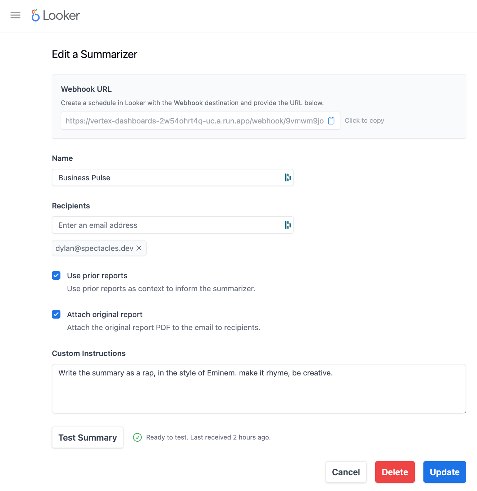
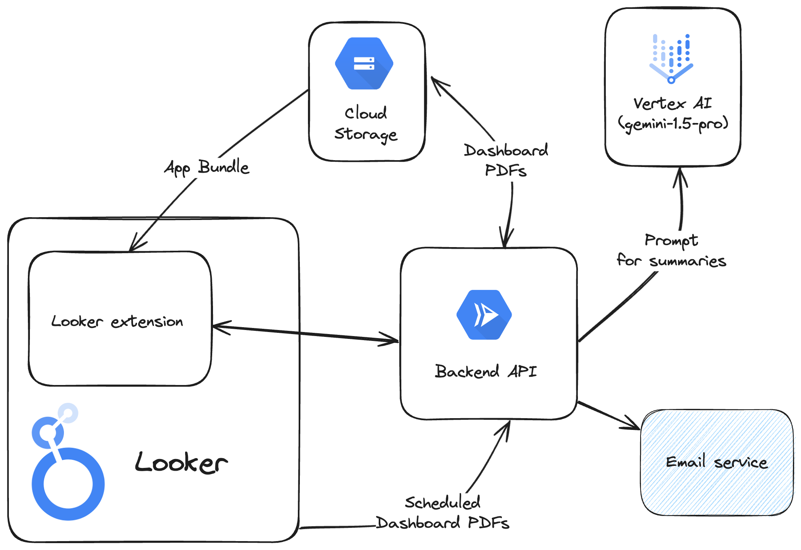

# tl;dd

*tl;dd was created by the team at [Spectacles](https://spectacles.dev) for the Looker Vertex AI Hackathon in June 2024.*

tl;dd (too long, didn't dashboard) is a Looker application (extension) that creates AI summarizers for Looker dashboards that send scheduled emails to recipients in your organization.



These emails are just like the ones sent from Looker schedules, but include a bulleted text summary in the body of the email that looks like this:

### Example tl;dd email

#### Key Insights

 - **Sales are up, but growth is flat:** Total sales continue to climb year-over-year, but the growth rate is consistent with the previous period.
 - **Orders are also up, but holding steady:** Orders are up 47% year-over-year, maintaining the same growth as the last report.
 - **Gender split is basically the same:** 73% of customers are female vs 74% male, which is practically identical to the last report. Our target audience appears to be consistent.
 - **Repeat purchases are still nonexistent:** The repeat purchase rate remains at 0.0%. We need to develop strategies to encourage customers to return.
 - **Website conversions are stuck:** While the dashboard does not show the specific conversion rate, it highlights that it has remained stagnant and suggests focusing on optimizing for conversions.

#### Questions to Explore

 - What can we do to accelerate sales growth?
 - How can we incentivize repeat purchases and build customer loyalty?
 - Are there untapped opportunities to reach a wider audience beyond our core demographic?
 - What specific actions can be taken to improve website conversion rates?
 - How effective are our current marketing campaigns and where can we optimize for better results?

## Add tl;dd to your Looker instance

tl;dd is a Looker extension with an external API. You'll need to deploy the application in your GCP account, then update the manifest file in your Looker project to point to the deployed application.

### Deploy the backend on GCP

tl;dd relies on a backend API deployed as a Cloud Run service with Cloud Firestore as a database.

The easiest way to deploy this API is using Terraform.

### Update your manifest file

Add the following to your `manifest.lkml` file in your Looker project (you may need to create this file if it doesn't already exist).

```lookml
application: tldd {
  label: "tldd"
  url: "https://storage.googleapis.com/tldd-frontend/bundle.js"
  entitlements: {
    use_clipboard: yes
    use_form_submit: yes
    external_api_urls: ["https://vertex-dashboards-2w54ohrt4q-uc.a.run.app", "https://localhost:8080"]
    global_user_attributes: ["looker_hackathon_vertexai_tldd_api"]
  }
}
```

## Application stack



tl;dd is composed of a **React** frontend, styled with **Tailwind CSS**. It uses the **Looker Extension SDK** to copy to clipboard and submit forms to the backend API.

The backend API is a **FastAPI** (Python) application with a **Cloud Firestore** document-storage database. The backend API communicates with the `gemini-pro-1.5` model on **Vertex AI** to generate summaries.

Received documents from Looker are stored in **Google Cloud Storage**, which is also used as a basic CDN for serving the frontend JavaScript bundle.

You can configure any email service like Sendgrid or Mailgun to send the summary emails. We've opted to use **[Resend](https://resend.com/)**.

## Future development

The tl;dd API is a public API and does not yet implement authentication. This is a security risk because anyone who knows the URL of the API and an ID of a summarizer can generate summaries for all dashboards that summarizer has received.

Our first priority for future development is to resolve this by implementing a shared secret between the Looker application and the backend API.